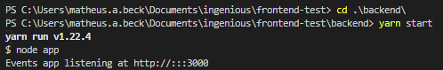
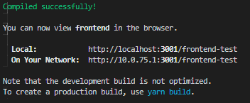

# 👨‍💻 Full Stack Engineer Challenge

<p align="center">
  
</p>

<p align="center">
  
  
  
  
</p>

Events App developed using React.js for the Full Stack Engineer challenge from a company.  
You can find a deployed version of the app here: https://matheus-beck.github.io/frontend-test/

## 🎥 App Demonstration


## 💾 Development Dependencies Used
- "axios": "^0.20.0",
- "gh-pages": "^3.1.0",
- "list-react-files": "^0.2.0",
- "polished": "^4.0.3",
- "react": "^16.14.0",
- "react-dom": "^16.14.0",
- "react-icons": "^3.11.0",
- "react-router-dom": "^5.2.0",
- "react-scripts": "3.4.3",
- "react-share": "^4.3.1",
- "styled-components": "^5.2.0"

## 🎬 Getting Started

1. Clone the project into your machine and install all dependencies described above using:

```console
yarn install
```

2. Now, to run the backend go to the backend folder and run:

```console
yarn start
```

2. Now, to run the frontend go to the frontend folder and run:

```console
yarn start
```

3. Verify the running results output:




<h2><a class="anchor" aria-hidden="true" href="#memo-license">:pencil:</a> License </h2>
<p>This project is under the MIT license. See the <a href="https://github.com/matheus-beck/blog/blob/master/LICENSE">LICENSE</a> for more information.</p>
---

Made with ❤️ by Matheus Beck 👋 [Get in touch!](https://www.linkedin.com/in/matheus-beck/)

